<h1>Rec Center React App</h1>

This is a social scheduling application for pickup basketball.

<h2>Vision</h2>

It's hard to find time to do activities with friends. Everyone's busy, and coordinating via group chat is draining. That's why I created this app, which lets you see the days everyone is available, to take the hassle out of scheduling. Right now it's only for basketball, but in the future I envision expanding it to any activity imagineable.

<h2>Stack</h2>
<ul>
  <li>MERN: React JS frontend, node JS and express for the backend, and MongoDB for the database.</li>
  <li>The styling is pure CSS via SASS. </li>
  <li>File storage is done via Multer and Amazon S3.</li>
  <li>The auth system uses React Context API and JSON Web Tokens (JWT) for validation.</li>
  <li>The notification system is built using socket.io for instant updates.</li>
  <li>The password reset is built using nodemailer and the Gmail API.</li>
</ul>

<h2>Functionality</h2>

First, set your schedule. The "ball now" icon automatically appears when you're available at the current time.

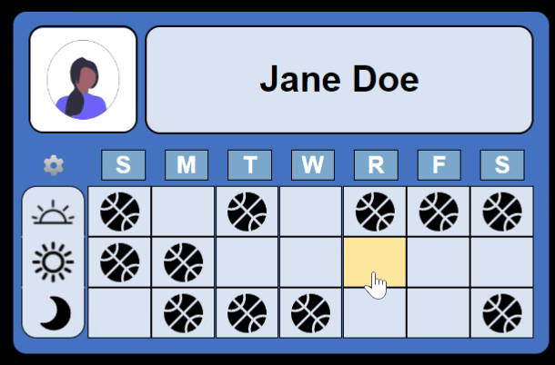

Now, join a group to start coordinating. You can either search for a friend's group, or make your own. Say Jane has a group called Best Friends. John can search for that group and request to join:

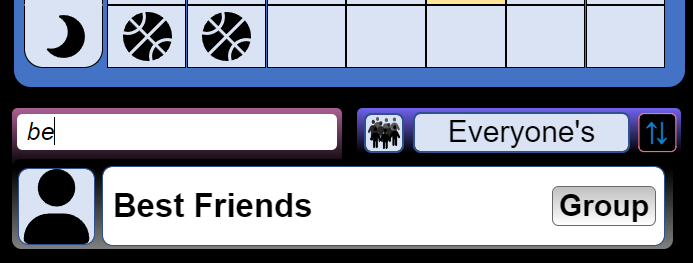
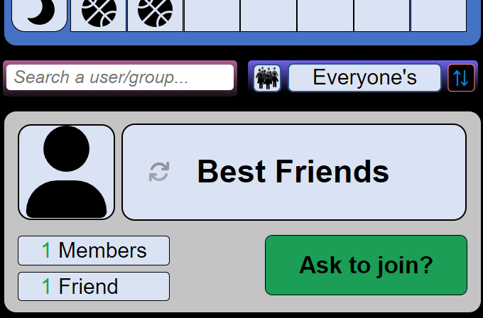
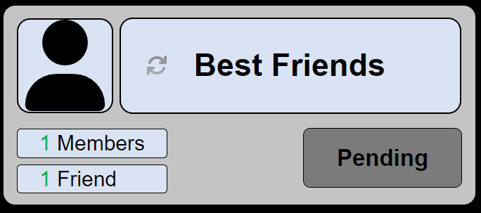

Next, Jane will get this request and can approve or deny it:

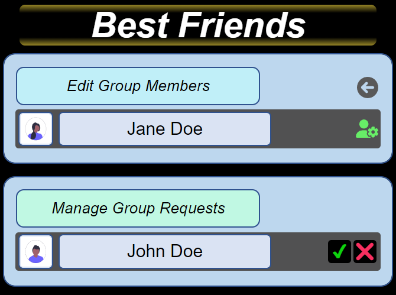

Alternately, John can make his own group and invite Jane. Jane will receive this invite:

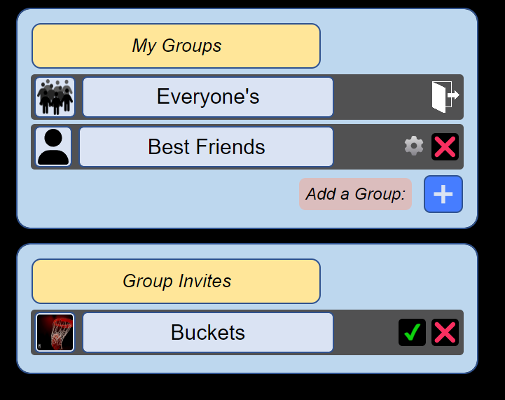

If she joins, her schedule will be added to the group's master schedule:

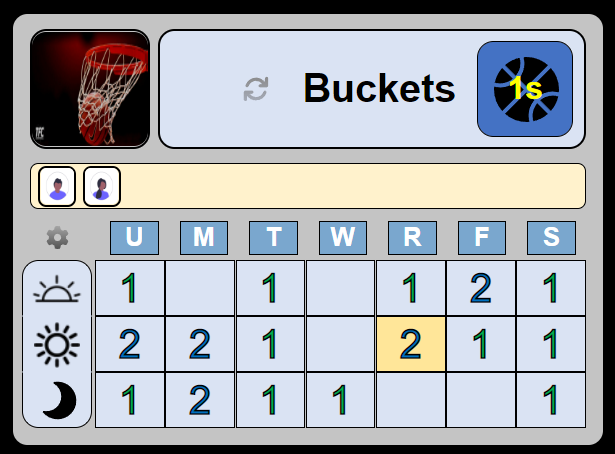

She can view who's available on a given day by clicking the square for that day/time. The blue icon on the upper right indicates what type of game is available currently. Right now, they can only play 1s (1 on 1).

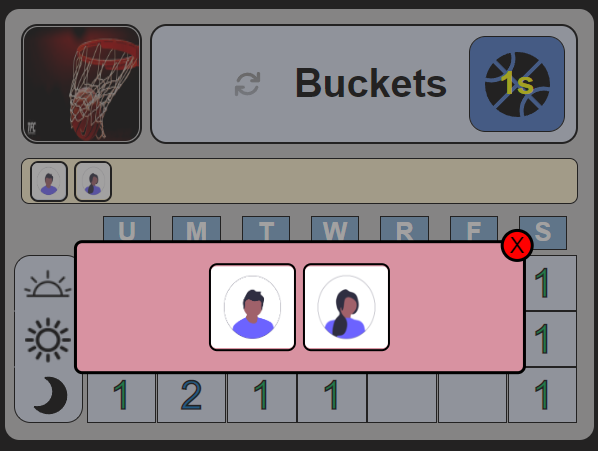

<h3>User System Features</h3>

Basic functionality includes updating your account:

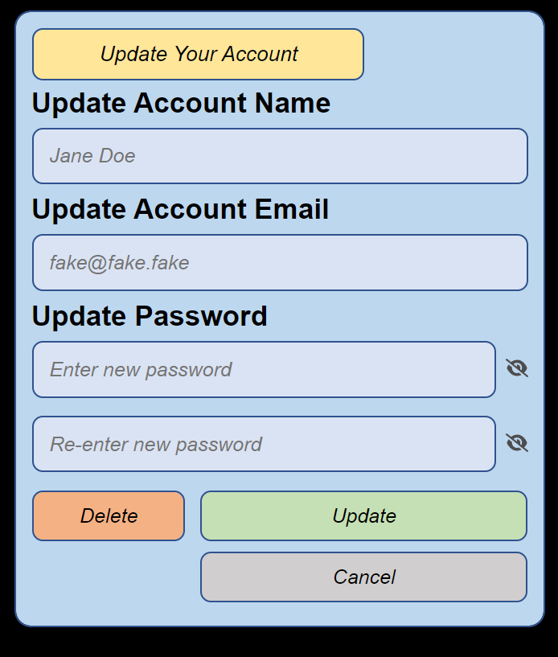

There is also a friend system that functions exactly like the group system:

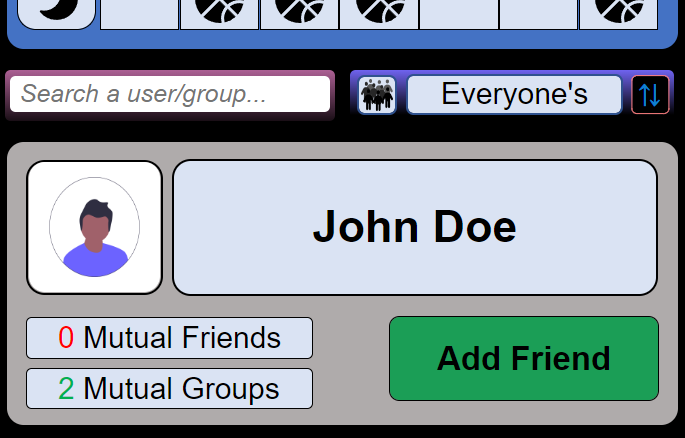
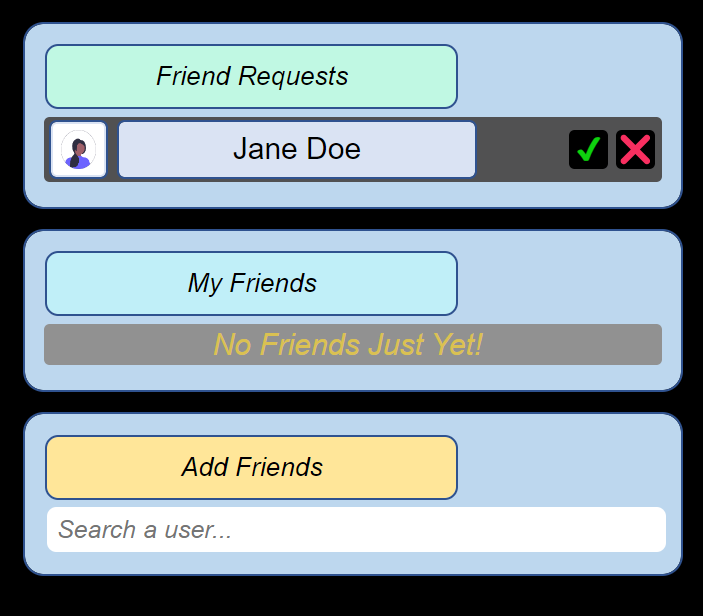

<h3>Notifications</h3>

Notifications show up on the menu, and hover over the relevant area:

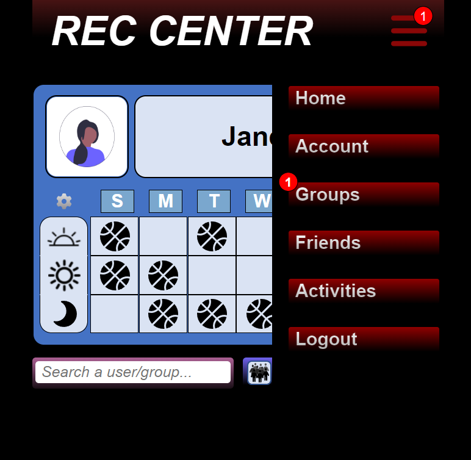

Notifications are instant thanks to socket.io 

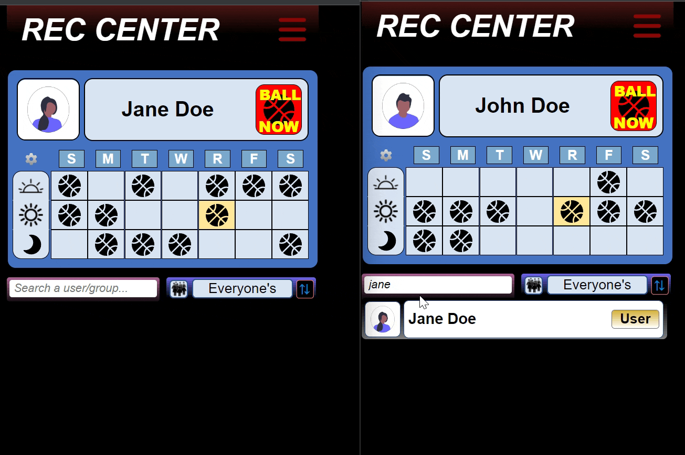
